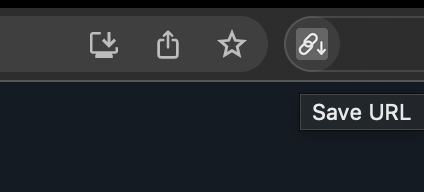
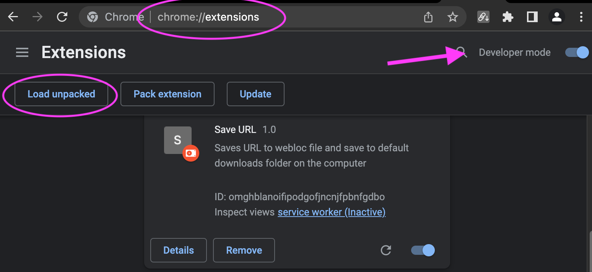

# url-downloader-chrome-extension

This simple chrome extension creates a webloc file and downloads it into the default download folder. 
The name of the file is taken from the title of the current open tap. 

## Usage
Press the extension icon to create a webloc file of the current open tab.


## Installation
Download the repository and add the extension as local unpacked to chrome. 
To do that make sure to set the extension page into developer mode.




## Webloc file format

A webloc file has the following format:

```
<?xml version="1.0" encoding="UTF-8"?>
<plist version="1.0">
<dict>
<key>URL</key>
<string>https://github.com</string>
<key>title</key>
<string>Github_com</string>
</dict>
</plist>

```
